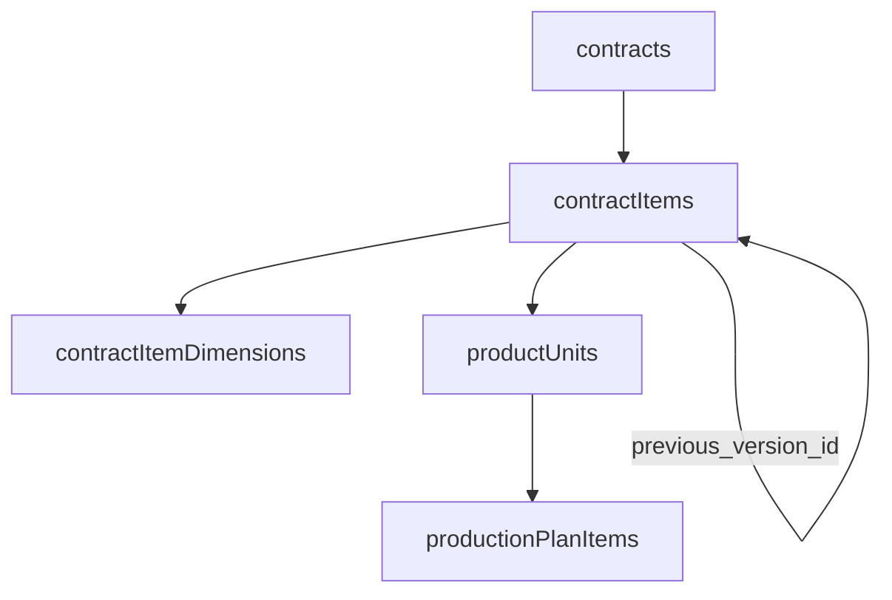

# Application Logic

Business logic **not** enforced by database triggers must be implemented in NestJS services. Schema columns marked `// app-synced` are maintained by the application.

`boms.unit_cost` and `inventory_transaction_items.unit_cost` are **not** app-synced — they are user-provided at creation (historical cost record) and should be omitted from update DTOs.

---

## 1. Totals recalculation

Recalculate parent totals inside a transaction whenever line items are created, updated, or deleted.

| Target column                           | Source table                    | Formula                                                 |
| --------------------------------------- | ------------------------------- | ------------------------------------------------------- |
| `offers.total_amount`                   | `offer_items`                   | `SUM(quantity * unit_price)`                            |
| `contracts.total_amount`                | `contract_items`                | `SUM(quantity * unit_price) WHERE cancelled_at IS NULL` |
| `material_purchase_orders.total_amount` | `material_purchase_order_items` | `SUM(quantity_ordered * unit_cost)`                     |
| `product_purchase_orders.total_amount`  | `product_purchase_order_items`  | `SUM(quantity_ordered * unit_cost)`                     |

Default to `0` when no items remain.

---

## 2. Cached quantity sync

### `materials.quantity`

- **Source:** `inventory_transaction_items` (via parent `inventory_transactions.transaction_type`)
- **On insert:** `receipt` → add quantity; `issue` → subtract; `return` → add (if used)
- **On delete:** revert the original effect
- **On update:** revert old effect, apply new effect
- **Concurrency:** use `sql\`quantity + ${amount}\`` in a transaction — never read-modify-write in Node

---

## 3. Completion timestamps

| Column                                  | When to set                                                                                      |
| --------------------------------------- | ------------------------------------------------------------------------------------------------ |
| `material_purchase_orders.completed_at` | All order lines fully received (received + rejected = ordered) across non-cancelled receipts     |
| `product_purchase_orders.completed_at`  | All ordered units have a linked `product_purchase_receipt_items` row (one unit per receipt line) |

Clear `completed_at` if receipts are reversed and the order is no longer fully fulfilled.

---

## 4. Product unit lifecycle

### Serial number (`product_units.serial_number`)

- Auto-generate when units are created for a contract (before physical receipt/production).
- Must remain unique; omit from update DTOs.

### Cancellation (`product_units.cancelled_at`)

- Set when parent `contract_item` is cancelled/replaced, or when quantity decrease drops individual units.
- Cancelled units are excluded from production, delivery, and installation workflows.
- When computing `produced_at`, ignore `production_plan_items` where `cancelled_at` is set.

### Timestamp sync (`product_units` — all `// app-synced`)

| Column         | Source event                                                                                         |
| -------------- | ---------------------------------------------------------------------------------------------------- |
| `produced_at`  | Manufactured: when the last `production_plan_items` row for the unit has `completed_at` set          |
| `received_at`  | Imported: when linked via `product_purchase_receipt_items` and parent receipt `received_at` is set   |
| `delivered_at` | When parent `deliveries.delivered_at` is set for a `delivery_items` row referencing the unit         |
| `installed_at` | When parent `installations.installed_at` is set for an `installation_items` row referencing the unit |

Update or clear timestamps if the source event is undone (e.g. delivery cancelled).

---

## 5. RFP field sync

See [`db-duplications.md`](./db-duplications.md) for what **RFP** (Redundant For Performance) means and the full column list. On contract creation:

- Set `contracts.customer_id` from `inquiries.customer_id`.
- Throw `BadRequestException` if they would diverge.

---

## 6. Business validations

### Inventory transaction item sources (`inventory_transaction_items`)

- `material_purchase_receipt_item_id` only when parent `transaction_type = 'receipt'`
- `production_plan_item_id` only when parent `transaction_type = 'issue'`
- At most one source FK set (DB check enforces non-conflict; validate type match in service)
- **Exception:** `BadRequestException('Invalid item source for transaction type')`

### Material purchase receipt quantities (`material_purchase_receipt_items`)

- Sum of `quantity_received + quantity_rejected` per `material_purchase_order_item_id` (non-cancelled receipts) must not exceed `material_purchase_order_items.quantity_ordered`
- **Exception:** `BadRequestException('Purchase receipt totals exceed ordered quantity')`

### Product purchase receipts (`product_purchase_receipt_items`)

- Each `product_unit_id` is unique (one receipt line per unit)
- Unit's `contract_item_id` must match `product_purchase_order_items.contract_item_id` for the linked PO line
- **Exception:** `BadRequestException` with a clear message

### Production plan items (`production_plan_items`)

- `production_department_id` must reference a department whose `parent_id` equals `PRODUCTION_DEPARTMENT_ID` (seeded Production root)
- **Exception:** `BadRequestException('Production department must be a child of Production')`

### Contract delivery address (`contracts.delivery_address_id`)

- Address must belong to `contracts.customer_id` (via `customer_addresses.customer_id`)
- **Exception:** `BadRequestException('Delivery address does not belong to customer')`

### Default addresses (`customer_addresses`, `vendor_addresses`)

- Only one `is_default = true` per customer/vendor (partial unique index). Unset the previous default when setting a new one in the same transaction.

---

## 7. Workflow guards

### Inquiry → preview → offer → contract

**Header-level traceability.** `previews`, `offers`, and `contracts` each store `inquiry_id`. Downstream documents are not FK-linked to upstream line rows (`inquiry_items`, `preview_items`, `offer_items`).

**Line snapshots.** `preview_items`, `offer_items`, and `contract_items` are standalone lines on their parent document, identified by `product_code` (plus line-specific fields). When creating a preview, offer, or contract from an inquiry, copy line data from inquiry items in the service — do not persist `inquiry_item_id` on downstream lines.

- Contract linked to offer only if `offers.status = 'accepted'`
- Cannot downgrade offer from `accepted` while a contract references it
- **Exception:** `ConflictException` or `BadRequestException`

### Inquiry status (`inquiries.status`)

- Enforce valid transitions in the service (e.g. cannot skip required steps). Status is stored explicitly (not derived from dates).

### Offer status (`offers.status`)

- Enforce valid transitions; coordinate with inquiry status updates where required.

### Entity status from dates (no status enum — derive in API layer)

| Entity                     | Active                                      | Completed          | Cancelled          |
| -------------------------- | ------------------------------------------- | ------------------ | ------------------ |
| `contracts`                | no `completed_at` / `cancelled_at`          | `completed_at` set | `cancelled_at` set |
| `contract_items`           | no `cancelled_at`                           | —                  | `cancelled_at` set |
| `product_units`            | no `cancelled_at` (and not fully installed) | `installed_at` set | `cancelled_at` set |
| `production_plan_items`    | no `completed_at` / `cancelled_at`          | `completed_at` set | `cancelled_at` set |
| `previews`                 | scheduled, not completed/cancelled          | `completed_at` set | `cancelled_at` set |
| `deliveries`               | scheduled, not delivered/cancelled          | `delivered_at` set | `cancelled_at` set |
| `installations`            | scheduled, not installed/cancelled          | `installed_at` set | `cancelled_at` set |
| `material_purchase_orders` | open                                        | `completed_at` set | `cancelled_at` set |
| `product_purchase_orders`  | open                                        | `completed_at` set | `cancelled_at` set |

Mutually exclusive completion and cancellation timestamps where both exist.

---

## 8. Code immutability

Auto-generated `code` columns (DB trigger) must not appear in update DTOs or `UPDATE` statements. Omit `code` on insert DTOs — triggers assign it when null.

---

## 9. Soft delete / archival

Rows are rarely hard-deleted. Default list/detail queries should exclude inactive records unless the API explicitly includes archived or cancelled data.

Not every table uses `deleted_at` — some use `cancelled_at` or a `cancelled` status instead.

---

## 10. Contract lifecycle

Contracts (`contracts`) and their line items (`contract_items`) are amended through explicit workflows — append, cancel, or replace — never by mutating business fields in place. Line items are **immutable once written**; changes use cancel-and-replace. Nothing is hard-deleted.

### Principles

- **Soft cancellation** — `cancelled_at` marks a row inactive; history stays queryable.
- **Version chain** — replacement rows point to their predecessor via `previous_version_id` (new → old).
- **Cascade down** — cancelling an item cancels its `product_units` and their `production_plan_items`; cancelling the contract cancels all active items the same way.
- **Audit at the source** — `created_by`, `cancelled_by`, and `cancellation_reason` live on `contracts` (whole-order cancel) and `contract_items` (line cancel/replace), not on cascaded children.

### Entity model



`contract_item_dimensions` is 1:1 with an item. It has no cancellation column — when dimensions change, the whole item is replaced and a new dimensions row is created on the replacement item.

### Schema reference

**`contracts` (cancellation audit)**

| Column                | Role                               |
| --------------------- | ---------------------------------- |
| `cancelled_at`        | When the whole order was cancelled |
| `cancelled_by`        | Who cancelled the contract         |
| `cancellation_reason` | Why the contract was cancelled     |

**`contract_items`**

| Column                | Role                                                       |
| --------------------- | ---------------------------------------------------------- |
| `created_by`          | Who added this line (may differ from contract creator)     |
| `cancelled_at`        | When this line became inactive                             |
| `cancelled_by`        | Who triggered cancellation; null on contract-level cascade |
| `cancellation_reason` | Why the line was cancelled or replaced                     |
| `previous_version_id` | On replacement rows only — FK to the cancelled predecessor |

**Cascade only** (no audit fields): `product_units.cancelled_at`, `production_plan_items.cancelled_at` (mutually exclusive with `completed_at`).

### Operations

All steps run inside a **single transaction**. Recalculate `contracts.total_amount` after append, cancel, or replace (see §1).

#### Mutation triggers

| Business change               | Operation                 |
| ----------------------------- | ------------------------- |
| New line on contract          | Append                    |
| Line removed                  | Cancel item               |
| Quantity changed              | Replace item              |
| Dimensions updated (reprices) | Replace item              |
| Unit price changed            | Replace item              |
| Product code swapped          | Replace item              |
| Whole contract cancelled      | Cancel contract → cascade |

#### Workflows

| Operation           | When                                                                 | Steps                                                                                                                                                                                                                                                                                                                                                                                             |
| ------------------- | -------------------------------------------------------------------- | ------------------------------------------------------------------------------------------------------------------------------------------------------------------------------------------------------------------------------------------------------------------------------------------------------------------------------------------------------------------------------------------------- |
| **Append**          | New line added to an existing contract                               | 1. INSERT `contract_items` (`previous_version_id = null`, `created_by` = acting user). 2. INSERT `contract_item_dimensions` if custom dimensions apply. 3. CREATE `product_units` (count = quantity, auto serial numbers). 4. Recalculate `contracts.total_amount`. No prior row is cancelled.                                                                                                    |
| **Cancel item**     | Line removed from contract                                           | 1. UPDATE item: `cancelled_at`, `cancelled_by`, `cancellation_reason`. 2. CASCADE: `cancelled_at` on active `product_units`. 3. CASCADE: `cancelled_at` on active `production_plan_items` for those units. 4. Recalculate `contracts.total_amount`.                                                                                                                                               |
| **Replace item**    | Quantity, dimensions (reprices), unit price, or product code changes | 1. INSERT replacement `contract_items` with new values, `previous_version_id = old id`, `created_by`. 2. UPDATE old item: `cancelled_at`, `cancelled_by`, `cancellation_reason`. 3. CASCADE old item's active units and plan items. 4. INSERT new `contract_item_dimensions` on replacement when dimensions change. 5. Apply quantity delta (see below). 6. Recalculate `contracts.total_amount`. |
| **Cancel contract** | Whole order cancelled                                                | 1. UPDATE `contracts`: `cancelled_at`, `cancelled_by`, `cancellation_reason`. 2. App-sync `cancelled_at` on all active `contract_items` (item-level `cancelled_by` / `cancellation_reason` null). 3. CASCADE each item → units → plan items. 4. Recalculate `contracts.total_amount` (will be `0`).                                                                                               |

#### Quantity delta on replace

After the replacement item exists and the old item is cancelled:

| Change     | Units                                                                                    |
| ---------- | ---------------------------------------------------------------------------------------- |
| Quantity ↑ | Create additional `product_units` under the **new** item (auto serial numbers)           |
| Quantity ↓ | Cancel excess **active** units on the **old** item; cancel their `production_plan_items` |
| Unchanged  | Create fresh units under the **new** item; old units stay on cancelled item for history  |

Material returns from cancelled in-progress work (inventory transactions, semi-finished returns) are **not** implemented yet — leave hooks for a later pass.

### Cancellation cascades

**Item cancelled** (directly or via contract cancel):

1. Set `cancelled_at` on all active `product_units` for that item.
2. Set `cancelled_at` on all active `production_plan_items` for those units.

**Unit cancelled** (quantity decrease on replace):

1. Set `cancelled_at` on all active `production_plan_items` for that unit.

Do **not** set `cancelled_by` or `cancellation_reason` on cascaded `product_units` or `production_plan_items`.

**Contract cancel — item sync:** set `cancelled_at`, `cancelled_by`, and `cancellation_reason` on the `contracts` row. App-sync `cancelled_at` on every `contract_item` where `cancelled_at IS NULL`. Do not set `cancelled_by` or `cancellation_reason` on those item rows (the contract row holds the audit trail for whole-order cancellation).

### Version history

Replacements form a linked list via `previous_version_id`:

```
Item A (cancelled)  ←  Item B (cancelled)  ←  Item C (active)
     ↑                        ↑                      |
     └──── previous_version_id ┴──── previous_version_id
```

- **Forward:** follow `previous_version_id` from the current row to older versions.
- **Backward:** `SELECT * FROM contract_items WHERE previous_version_id = :id` to find what replaced a given row.

#### Query patterns

| Need                           | Filter                                                                                |
| ------------------------------ | ------------------------------------------------------------------------------------- |
| Active lines on a contract     | `contract_id = ? AND cancelled_at IS NULL`                                            |
| Full line history              | `contract_id = ?` (include cancelled)                                                 |
| Replacement chain for one line | Walk `previous_version_id` forward, or `WHERE previous_version_id = ?` for successors |
| Units ready for production     | `contract_item_id = ? AND cancelled_at IS NULL`                                       |
| Active plan work               | `production_plan_items` where `cancelled_at IS NULL AND completed_at IS NULL`         |

### Validations and DTOs

**Validations**

- Reject replace/cancel on items where `cancelled_at` is already set.
- Reject append/replace/cancel when parent `contracts.cancelled_at` or `contracts.completed_at` is set (unless business rules allow amendments — enforce in service).
- Replacement item must reference the immediately preceding version via `previous_version_id`.

**DTO / update rules**

- **`contracts`** — omit from update DTOs: `cancelled_at`, `cancelled_by`, `cancellation_reason` (set only via cancel workflow).
- **`contract_items`** — omit from update DTOs: `previous_version_id`, `cancelled_at`, `cancelled_by`, `cancellation_reason`, `created_by` (set on insert only).
- Never hard-delete `contract_items`, `product_units`, or `production_plan_items`.
