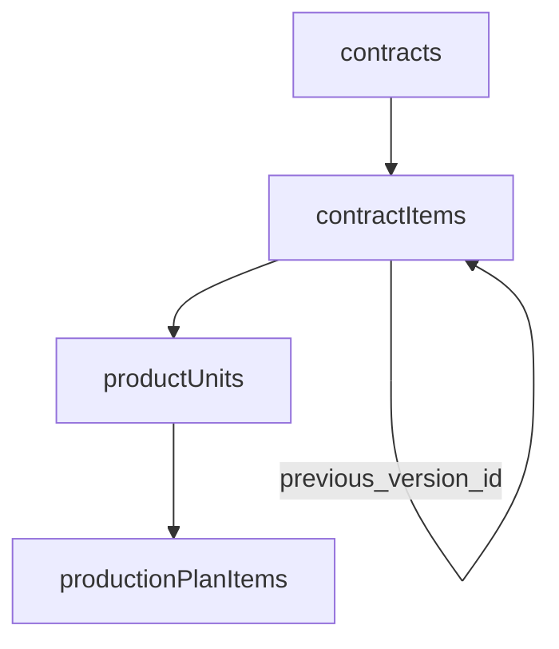

# Application Logic

Business logic **not** enforced by database triggers must be implemented in NestJS services.

| Schema marker    | Meaning                                                                                                   |
| ---------------- | --------------------------------------------------------------------------------------------------------- |
| `// app-synced`  | The application **writes** this column from other tables or events (derived/cached values).               |
| `// app-checked` | The application **validates** this column on create/update (cross-table rules, conditional requiredness). |

`inventory_transaction_items.unit_cost` is **not** app-synced — it is user-provided at creation (actual cost at time of transaction) and should be omitted from update DTOs.

---

## 1. Totals recalculation

Recalculate parent totals inside a transaction whenever line items are created, updated, or deleted.

| Target column                           | Source table                    | Formula                                                 |
| --------------------------------------- | ------------------------------- | ------------------------------------------------------- |
| `offers.total_amount`                   | `offer_items`                   | `SUM(quantity * unit_price)`                            |
| `contracts.total_amount`                | `contract_items`                | `SUM(quantity * unit_price) WHERE cancelled_at IS NULL` |
| `material_purchase_orders.total_amount` | `material_purchase_order_items` | `SUM(quantity_ordered * unit_cost)`                     |
| `product_purchase_orders.total_amount`  | `product_purchase_order_items`  | `SUM(quantity_ordered * unit_cost)`                     |

Default to `0` when no items remain.

**Negotiated totals (not stored):** `offers.discount_pct` and `contracts.discount_pct` are separate from `total_amount`. Compute the negotiated total in the API as `total_amount * (1 - discount_pct / 100)` when `discount_pct` is set; otherwise use `total_amount`. Do not bake the discount into line `unit_price` or parent `total_amount`.

---

## 2. Cached quantity sync

### `materials.quantity`

- **Source:** `inventory_transaction_items` (via parent `inventory_transactions.transaction_type`)
- **On insert:** `receipt` → add quantity; `issue` → subtract; `return` → add (if used)
- **On delete:** revert the original effect
- **On update:** revert old effect, apply new effect
- **Concurrency:** use `sql\`quantity + ${amount}\`` in a transaction — never read-modify-write in Node

---

## 3. Completion timestamps

| Column                                  | When to set                                                                                      |
| --------------------------------------- | ------------------------------------------------------------------------------------------------ |
| `material_purchase_orders.completed_at` | All order lines fully received (received + rejected = ordered) across all receipts               |
| `product_purchase_orders.completed_at`  | All ordered units have a linked `product_purchase_receipt_items` row (one unit per receipt line) |

Clear `completed_at` if receipts are reversed and the order is no longer fully fulfilled.

---

## 4. Product unit lifecycle

### Serial number (`product_units.serial_number`)

- Auto-generate when units are created for a contract (before physical receipt/production).
- Must remain unique; omit from update DTOs.

### Cancellation (`product_units.cancelled_at`)

- Set when parent `contract_item` is cancelled/replaced, or when quantity decrease drops individual units.
- Cancelled units are excluded from production, delivery, and installation workflows.
- When computing `produced_at`, ignore `production_plan_items` where `cancelled_at` is set.

### Timestamp sync (`product_units` — all `// app-synced`)

| Column                | Source event                                                                                                                                                                 |
| --------------------- | ---------------------------------------------------------------------------------------------------------------------------------------------------------------------------- |
| `produced_at`         | Manufactured: when the last `production_plan_items` row for the unit has `completed_at` set                                                                                  |
| `received_at`         | Imported: when linked via `product_purchase_receipt_items` and parent receipt `received_at` is set                                                                           |
| `delivered_at`        | When parent `deliveries.completed_at` is set for a `delivery_items` row referencing the unit                                                                                 |
| `installed_at`        | When parent `installations.completed_at` is set for an `installation_items` row referencing the unit                                                                         |
| `warranty_started_at` | When parent `customer_receptions.received_at` is set for a `customer_reception_items` row referencing the unit (warranty is 1 year from this date — compute end date in API) |
| `cancelled_at`        | When parent `contract_items` is cancelled/replaced (cascade), or unit is dropped on quantity decrease                                                                        |

Update or clear timestamps if the source event is undone (e.g. delivery cancelled).

---

## 5. RFP field sync

See [`db-duplications.md`](./db-duplications.md) for what **RFP** (Redundant For Performance) means and the full column list.

Every RFP column is also `// app-checked` in the schema — set from the canonical source on insert and keep consistent; treat as immutable after insert unless the driving FK changes (re-validate and re-sync in service).

On contract creation:

- Set `contracts.customer_id` from `inquiries.customer_id`.
- Reject when inquiry and contract customer would diverge.
- `delivery_address_id` must belong to that customer (see §6).
- When `offer_id` is set, set `contracts.discount_pct` from `offers.discount_pct` (may be `NULL`). When `offer_id` is null, `discount_pct` may be set directly on contract creation.

On maintenance order creation:

- Set `maintenance_orders.customer_id` from `customer_addresses.customer_id` via `customer_address_id`, or from the linked service agreement's address when `maintenance_type = 'service_contract'`.

On inquiry, offer, preview, and contract item creation:

- Set `product_code` from `product_dimensions.product_code` via `product_dimension_id`.

---

## 6. Business validations (`// app-checked`)

Rules below apply on create/update in NestJS. Mark the relevant schema column(s) with `// app-checked` and a brief inline reason.

### Inventory transaction item sources (`inventory_transaction_items` — `// app-checked`)

- `material_purchase_receipt_item_id` only when parent `transaction_type = 'receipt'`
- `production_plan_item_id` only when parent `transaction_type = 'issue'`
- `maintenance_order_spare_part_id` only when parent `transaction_type = 'issue'`
- At most one source FK set (DB check enforces non-conflict; validate type match in service)

### Material purchase receipt quantities (`material_purchase_receipt_items`)

- Sum of `quantity_received + quantity_rejected` per `material_purchase_order_item_id` across all receipts must not exceed `material_purchase_order_items.quantity_ordered`
- Receipts have no `cancelled_at` — voiding a receipt (if supported) is an application workflow, not a schema column

### Product purchase order items (`product_purchase_order_items`)

- Each `(product_purchase_order_id, contract_item_id)` pair is unique (DB constraint) — one PO line per contract item

### Product purchase receipts (`product_purchase_receipt_items`)

- Each `product_unit_id` is unique (one receipt line per unit)
- Unit's `contract_item_id` must match `product_purchase_order_items.contract_item_id` for the linked PO line

### Production plan items (`production_plan_items.production_stage` — `// app-checked`)

- `production_stage` must be one of the `product_production_routes` rows configured for the unit's product (join via `product_units` → `contract_items` → `products`)
- A plan item can only be marked completed when the plan item for the **prior `sequence_order`** in that product's routing (same `product_unit_id`) is already completed, or there is no prior step

### Users — production sub-department (`users.production_sub_department` — `// app-checked`)

- Required (non-null) when `department_id` equals `PRODUCTION_DEPARTMENT_ID`
- Must be null when `department_id` is any other department or null

### Product production routes (`product_production_routes.sequence_order` — `// app-checked`)

- Defines step order within a product's routing; used by production plan prior-step completion checks (see above)
- `completion_percentage` values for a given `product_code` must sum to exactly `100` when at least one route row exists — enforced by deferred constraint trigger in [`triggers.sql`](../sql/triggers.sql) (not app-checked)
- Products with no route rows are allowed (routing not yet configured)

### Pipeline line items (`product_code` — `// RFP — app-checked` on inquiry/offer/preview/contract items)

- `product_code` must equal `product_dimensions.product_code` for the row's `product_dimension_id`
- Set from the dimension on insert (see §5); treat as immutable after insert

### Contract customer (`contracts.customer_id` — `// RFP — app-checked`)

- Must equal `inquiries.customer_id` for the row's `inquiry_id`
- Must equal `customer_addresses.customer_id` for `delivery_address_id`
- Set from inquiry on insert (see §5); treat as immutable unless `inquiry_id` changes (re-validate in service if ever allowed)

### Contract delivery address (`contracts.delivery_address_id` — `// app-checked`)

- Address must belong to `contracts.customer_id` (via `customer_addresses.customer_id`)

### Deliveries (`deliveries`)

- `contract_id` is required; site address is `contracts.delivery_address_id` via the contract FK (not stored on the delivery)

### Delivery items (`delivery_items` — `// app-checked`)

- `product_unit_id` must belong to the parent delivery's `contract_id` (`product_units` → `contract_items` → `contracts.id`)

### Installations (`installations`)

- `contract_id` is required; site address is `contracts.delivery_address_id` via the contract FK (not stored on the installation)

### Installation items (`installation_items` — `// app-checked`)

- `product_unit_id` must belong to the parent installation's `contract_id` (`product_units` → `contract_items` → `contracts.id`)

### Trips (`trips`)

- Optional grouping for deliveries, installations, and maintenance orders traveling together on the same vehicle
- A trip's address list is derived (not stored): for deliveries/installations use `contracts.delivery_address_id`; for maintenance orders use `customer_address_id` when set, otherwise `service_agreements.customer_address_id` via `service_agreement_id`
- Completion is tracked per linked task, not on the trip header
- Reject linking tasks to a cancelled trip

### Customer receptions (`customer_receptions` — `// app-checked`)

- `customer_id` must match the customer on every unit's contract (`product_units` → `contract_items` → `contracts.customer_id`)
- When `delivery_id` is set, every `customer_reception_items.product_unit_id` must appear in `delivery_items` for that delivery
- When `installation_id` is set, every `customer_reception_items.product_unit_id` must appear in `installation_items` for that installation
- `delivery_id` and `installation_id` are optional and independent — both may be set, one may be set, or both null (e.g. factory pickup)
- Reject cancellation of a delivery or installation when a `customer_receptions` row references it

### Customer reception items (`customer_reception_items`)

- Each `product_unit_id` is unique (one reception per unit)
- Unit must not be cancelled (`product_units.cancelled_at IS NULL`)

### Service agreements (`service_agreements`)

- Customer is derived from `customer_address_id` (`customer_addresses.customer_id`); no separate `customer_id` column on the agreement

### Maintenance order customer (`maintenance_orders.customer_id` — `// RFP — app-checked`)

- Must equal `customer_addresses.customer_id` for `customer_address_id`
- When `maintenance_type = 'service_contract'`, must equal the customer on `service_agreements.customer_address_id`
- Set on insert from the address or agreement chain (see §5); treat as immutable unless the driving address/agreement FK changes

### Maintenance order items (`maintenance_order_items` — `// app-checked`)

- Each `(maintenance_order_id, product_unit_id)` pair is unique (DB constraint)
- `product_unit_id` must belong to the maintenance order's `customer_id` (`product_units` → `contract_items` → `contracts.customer_id`)
- Unit must not be cancelled (`product_units.cancelled_at IS NULL`)
- When `maintenance_type = 'in_warranty'`, unit's `warranty_started_at` must be set and warranty must not be expired (1 year from `warranty_started_at` — compute in API)
- When `maintenance_type = 'service_contract'`, the unit's contract `delivery_address_id` must match `service_agreements.customer_address_id`

### Default addresses (`customer_addresses`, `vendor_addresses`)

- Only one `is_default = true` per customer/vendor — enforced by partial unique index (not app-checked). Unset the previous default when setting a new one in the same transaction to avoid insert/update conflicts.

### Default dimension (`product_dimensions`)

- Only one `is_default = true` per product — enforced by partial unique index (not app-checked). Unset the previous default when setting a new one in the same transaction to avoid insert/update conflicts.

### Catalog unit price (`products.pricing_factor`)

- **BOM total cost:** `SUM(product_standard_boms.quantity_required * materials.unit_cost)` for the selected `product_dimension_id` (join `product_standard_boms` → `materials` via `material_code`).
- **Suggested unit price:** `BOM total cost * products.pricing_factor`.
- `pricing_factor` must be `> 0` (DB check). Apply rounding in the service when persisting offer/contract line prices.

---

## 7. Workflow guards

### Inquiry → preview → offer → contract

**Header-level traceability.** `previews`, `offers`, and `contracts` each store `inquiry_id`. Downstream documents are not FK-linked to upstream line rows (`inquiry_items`, `preview_items`, `offer_items`).

**Line snapshots.** `preview_items`, `offer_items`, and `contract_items` are standalone lines on their parent document, identified by `product_dimension_id` (plus line-specific fields). When creating a preview, offer, or contract from an inquiry, copy line data from inquiry items in the service — do not persist `inquiry_item_id` on downstream lines. Set `product_code` (RFP) from the selected dimension on insert.

- Contract linked to offer only if `offers.status = 'accepted'`
- Cannot downgrade offer from `accepted` while a contract references it

### Inquiry status (`inquiries.status`)

- Enforce valid transitions in the service (e.g. cannot skip required steps). Status is stored explicitly (not derived from dates).

### Offer status (`offers.status`)

- Enforce valid transitions; coordinate with inquiry status updates where required.

### Offer negotiation (`offers.discount_pct`, `offer_negotiations`)

- Negotiation is a **blanket discount at the offer header**, not per line item.
- `offer_negotiations` is an **append-only** round log — no edits or hard-deletes. Each row records one proposed discount for a round.
- `party` (`customer` | `company`) labels whose position the row records, not who authenticated in the system. Customers are not `users`; `created_by` is always the internal sales user logging the round (phone/email).
- `discount_pct` on each negotiation row is the proposed discount for that round (0–100). When `party = 'company'`, enforce the acting user's role discount cap (see §11); customer-position rows are not capped.
- `offers.discount_pct` holds the **currently agreed** discount. Update it in the service when a round is accepted — it is **not** auto-synced from the log's last row, and is not `// app-checked` in schema.
- Reject new negotiation rounds when parent `offers.status` is `accepted`, `rejected`, or `cancelled`.
- On contract creation from an accepted offer, copy `offers.discount_pct` to `contracts.discount_pct` (see §5). `contract_items.unit_price` stays the pre-discount quoted price.

### Vendor quotation email status (`vendor_quotation_emails.status`)

- Values: `draft`, `sent`, `failed` — no `cancelled` state; a failed send remains `failed` for audit

### Entity status from dates (no status enum — derive in API layer)

| Entity                       | Active                                                                                                  | Completed                 | Cancelled          |
| ---------------------------- | ------------------------------------------------------------------------------------------------------- | ------------------------- | ------------------ |
| `contracts`                  | no `completed_at` / `cancelled_at`; pending start (`started_at` null) or in progress (`started_at` set) | `completed_at` set        | `cancelled_at` set |
| `contract_items`             | no `cancelled_at`                                                                                       | —                         | `cancelled_at` set |
| `product_units`              | no `cancelled_at` (and not yet received by customer)                                                    | `warranty_started_at` set | `cancelled_at` set |
| `production_plan_items`      | no `completed_at` / `cancelled_at`                                                                      | `completed_at` set        | `cancelled_at` set |
| `previews`                   | scheduled, not completed/cancelled                                                                      | `completed_at` set        | `cancelled_at` set |
| `deliveries`                 | scheduled, not completed/cancelled                                                                      | `completed_at` set        | `cancelled_at` set |
| `installations`              | scheduled, not completed/cancelled                                                                      | `completed_at` set        | `cancelled_at` set |
| `trips`                      | scheduled, not cancelled                                                                                | —                         | `cancelled_at` set |
| `customer_receptions`        | —                                                                                                       | `received_at` set         | —                  |
| `maintenance_orders`         | scheduled, not completed/cancelled                                                                      | `completed_at` set        | `cancelled_at` set |
| `material_purchase_orders`   | open                                                                                                    | `completed_at` set        | `cancelled_at` set |
| `product_purchase_orders`    | open                                                                                                    | `completed_at` set        | `cancelled_at` set |
| `material_purchase_receipts` | —                                                                                                       | `received_at` set         | —                  |
| `product_purchase_receipts`  | —                                                                                                       | `received_at` set         | —                  |

Receipts (`material_purchase_receipts`, `product_purchase_receipts`) have no cancellation column — completion is derived from `received_at`.

Mutually exclusive completion and cancellation timestamps where both exist.

---

## 8. Code immutability

Auto-generated `code` columns (DB trigger) must not appear in update DTOs or `UPDATE` statements. Omit `code` on insert DTOs — triggers assign it when null.

---

## 9. Soft delete / archival

Rows are rarely hard-deleted. Default list/detail queries should exclude inactive records unless the API explicitly includes archived or cancelled data.

Not every table uses `deleted_at` — some use `cancelled_at` or a `cancelled` status instead.

---

## 10. Contract lifecycle

Contracts (`contracts`) and their line items (`contract_items`) are amended through explicit workflows — append, cancel, or replace — never by mutating business fields in place. Line items are **immutable once written**; changes use cancel-and-replace. Nothing is hard-deleted.

### Principles

- **Soft cancellation** — `cancelled_at` marks a row inactive; history stays queryable.
- **Version chain** — replacement rows point to their predecessor via `previous_version_id` (new → old).
- **Cascade down** — cancelling an item cancels its `product_units` and their `production_plan_items`; cancelling the contract cancels all active items the same way.
- **Audit at the source** — `created_by`, `cancelled_by`, and `cancellation_reason` live on `contracts` (whole-order cancel) and `contract_items` (line cancel/replace), not on cascaded children.

### Entity model



Dimensions are selected via `contract_items.product_dimension_id` (catalog `product_dimensions` row). When dimensions change, the whole item is replaced and the replacement row points at a different dimension variant.

### Schema reference

**`contracts` (lifecycle timestamps)**

| Column                | Role                                             |
| --------------------- | ------------------------------------------------ |
| `started_at`          | When work on the order began; null until started |
| `completed_at`        | When the whole order was completed               |
| `cancelled_at`        | When the whole order was cancelled               |
| `cancelled_by`        | Who cancelled the contract                       |
| `cancellation_reason` | Why the contract was cancelled                   |

**`contract_items`**

| Column                | Role                                                       |
| --------------------- | ---------------------------------------------------------- |
| `created_by`          | Who added this line (may differ from contract creator)     |
| `cancelled_at`        | When this line became inactive                             |
| `cancelled_by`        | Who triggered cancellation; null on contract-level cascade |
| `cancellation_reason` | Why the line was cancelled or replaced                     |
| `previous_version_id` | On replacement rows only — FK to the cancelled predecessor |

**Cascade only** (no audit fields): `product_units.cancelled_at`, `production_plan_items.cancelled_at` (mutually exclusive with `completed_at`).

### Operations

All steps run inside a **single transaction**. Recalculate `contracts.total_amount` after append, cancel, or replace (see §1).

#### Mutation triggers

| Business change               | Operation                 |
| ----------------------------- | ------------------------- |
| New line on contract          | Append                    |
| Line removed                  | Cancel item               |
| Quantity changed              | Replace item              |
| Dimensions updated (reprices) | Replace item              |
| Unit price changed            | Replace item              |
| Product dimension swapped     | Replace item              |
| Whole contract cancelled      | Cancel contract → cascade |

#### Workflows

| Operation           | When                                                                      | Steps                                                                                                                                                                                                                                                                                                             |
| ------------------- | ------------------------------------------------------------------------- | ----------------------------------------------------------------------------------------------------------------------------------------------------------------------------------------------------------------------------------------------------------------------------------------------------------------- |
| **Append**          | New line added to an existing contract                                    | 1. INSERT `contract_items` (`previous_version_id = null`, `created_by` = acting user, `product_dimension_id`, RFP `product_code`). 2. CREATE `product_units` (count = quantity, auto serial numbers). 3. Recalculate `contracts.total_amount`. No prior row is cancelled.                                         |
| **Cancel item**     | Line removed from contract                                                | 1. UPDATE item: `cancelled_at`, `cancelled_by`, `cancellation_reason`. 2. CASCADE: `cancelled_at` on active `product_units`. 3. CASCADE: `cancelled_at` on active `production_plan_items` for those units. 4. Recalculate `contracts.total_amount`.                                                               |
| **Replace item**    | Quantity, dimensions (reprices), unit price, or product dimension changes | 1. INSERT replacement `contract_items` with new values, `previous_version_id = old id`, `created_by`. 2. UPDATE old item: `cancelled_at`, `cancelled_by`, `cancellation_reason`. 3. CASCADE old item's active units and plan items. 4. Apply quantity delta (see below). 5. Recalculate `contracts.total_amount`. |
| **Cancel contract** | Whole order cancelled                                                     | 1. UPDATE `contracts`: `cancelled_at`, `cancelled_by`, `cancellation_reason`. 2. App-sync `cancelled_at` on all active `contract_items` (item-level `cancelled_by` / `cancellation_reason` null). 3. CASCADE each item → units → plan items. 4. Recalculate `contracts.total_amount` (will be `0`).               |

#### Quantity delta on replace

After the replacement item exists and the old item is cancelled:

| Change     | Units                                                                                    |
| ---------- | ---------------------------------------------------------------------------------------- |
| Quantity ↑ | Create additional `product_units` under the **new** item (auto serial numbers)           |
| Quantity ↓ | Cancel excess **active** units on the **old** item; cancel their `production_plan_items` |
| Unchanged  | Create fresh units under the **new** item; old units stay on cancelled item for history  |

Material returns from cancelled in-progress work (inventory transactions, semi-finished returns) are **not** implemented yet — leave hooks for a later pass.

### Cancellation cascades

**Item cancelled** (directly or via contract cancel):

1. Set `cancelled_at` on all active `product_units` for that item.
2. Set `cancelled_at` on all active `production_plan_items` for those units.

**Unit cancelled** (quantity decrease on replace):

1. Set `cancelled_at` on all active `production_plan_items` for that unit.

Do **not** set `cancelled_by` or `cancellation_reason` on cascaded `product_units` or `production_plan_items`.

**Contract cancel — item sync:** set `cancelled_at`, `cancelled_by`, and `cancellation_reason` on the `contracts` row. App-sync `cancelled_at` on every `contract_item` where `cancelled_at IS NULL`. Do not set `cancelled_by` or `cancellation_reason` on those item rows (the contract row holds the audit trail for whole-order cancellation).

### Version history

Replacements form a linked list via `previous_version_id`:

```
Item A (cancelled)  ←  Item B (cancelled)  ←  Item C (active)
     ↑                        ↑                      |
     └──── previous_version_id ┴──── previous_version_id
```

- **Forward:** follow `previous_version_id` from the current row to older versions.
- **Backward:** `SELECT * FROM contract_items WHERE previous_version_id = :id` to find what replaced a given row.

#### Query patterns

| Need                           | Filter                                                                                |
| ------------------------------ | ------------------------------------------------------------------------------------- |
| Active lines on a contract     | `contract_id = ? AND cancelled_at IS NULL`                                            |
| Full line history              | `contract_id = ?` (include cancelled)                                                 |
| Replacement chain for one line | Walk `previous_version_id` forward, or `WHERE previous_version_id = ?` for successors |
| Units ready for production     | `contract_item_id = ? AND cancelled_at IS NULL`                                       |
| Active plan work               | `production_plan_items` where `cancelled_at IS NULL AND completed_at IS NULL`         |

### Validations and DTOs

**Validations**

- Reject replace/cancel on items where `cancelled_at` is already set.
- Reject append/replace/cancel when parent `contracts.cancelled_at` or `contracts.completed_at` is set (unless business rules allow amendments — enforce in service).
- Replacement item must reference the immediately preceding version via `previous_version_id`.

**DTO / update rules**

- **`contracts`** — omit from update DTOs: `cancelled_at`, `cancelled_by`, `cancellation_reason` (set only via cancel workflow).
- **`contract_items`** — omit from update DTOs: `previous_version_id`, `cancelled_at`, `cancelled_by`, `cancellation_reason`, `created_by` (set on insert only).
- Never hard-delete `contract_items`, `product_units`, or `production_plan_items`.

---

## 11. Role discount cap and department scope

### Role discount cap (`roles.max_discount_pct` — `// app-checked`)

- On offer create/update and when appending `offer_negotiations` rows with `party = 'company'`, enforce the acting user's role discount cap (join `users` → `roles`) against `offer_negotiations.discount_pct`. When accepting a company round and updating `offers.discount_pct`, apply the same cap.
- When creating a contract without `offer_id` and setting `contracts.discount_pct`, enforce the same role discount cap.
- Admins (`isAdmin = true`, `roleId` null) are exempt — no role, no cap.
- `NULL` on the role means **no discount allowed** — reject any discount greater than `0`.
- A non-null value is the maximum discount percentage permitted (e.g. `10` → up to 10%). Reject when the requested discount exceeds that cap.

### Contract discount (`contracts.discount_pct` — `// app-checked`)

- When `offer_id` is set, must equal `offers.discount_pct` for that offer (copy on contract creation).
- When `offer_id` is null, may be set directly on contract creation (nullable). Enforce the acting user's role discount cap when a non-null value is provided (see §11).
- Treat as immutable after insert unless `offer_id` changes (re-validate in service if ever allowed).

### Role department scope (`roles.department_id` — `// app-checked`)

- Optional metadata: when set, the role is scoped to that department (e.g. Sales-only roles).
- On user create/update, when assigning a role, if the role has a non-null `departmentId`, it must equal the user's `departmentId` — reject mismatches.
- Re-validate when either `users.departmentId` or `users.roleId` is updated.
