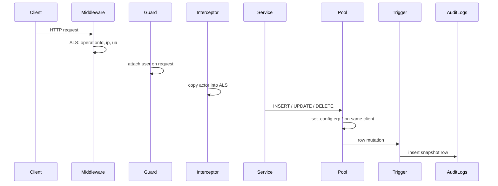

# Audit trail

Append-only change log for every row mutation across the ERP schema. One generic `audit_logs` table with full row snapshots (`jsonb`) supports three query patterns:

| Pattern | Example question | Primary filters |
| ------- | ---------------- | --------------- |
| **Entity timeline** | What changed on this customer / MPO line / permission? | `table_name` + `record_id` |
| **User activity** | What did this user change today? | `actor_user_id` + `created_at` |
| **Forensic reconstruction** | What was the exact row state before/after this change? | `GET /audit-logs/:id` (`old_row` / `new_row`) |

Related docs: [`tables-summary.md`](./tables-summary.md) (`audit_logs` row), [`db-duplications.md`](./db-duplications.md) (actor/parent/root snapshots), [`application-logic.md`](./application-logic.md) (global immutability policies).

---

## Design: hybrid writer

**Nest** supplies *who* and *which request* (actor, `operation_id`, IP, user agent).  
**Postgres** writes the audit row via an `AFTER ROW` trigger (snapshots, `changed_columns`, parent/root).

Domain services keep calling Drizzle `insert` / `update` / `delete` directly — **no** `AuditService.record()` hooks.



---

## End-to-end flow

### 1. Request context (Nest + ALS)

[`audit.context.ts`](../../utils/audit/audit.context.ts) uses **AsyncLocalStorage** (same pattern as locale) to hold a mutable store for the current async chain:

| Field | Set by | Purpose |
| ----- | ------ | ------- |
| `operationId` | Middleware (new UUID per HTTP request) | Groups every row written during one API call |
| `ipAddress` | Middleware | Client IP (`x-forwarded-for` or socket) |
| `userAgent` | Middleware | Browser/client string |
| `actorUserId` … `actorDepartmentId` | Interceptor (after auth guards) | Point-in-time actor snapshots |
| `auditSkip` | Scripts / manual ALS | When `true`, trigger skips emit |

**Middleware** — [`audit-context.middleware.ts`](../../utils/middlewares/audit-context.middleware.ts) runs on every route (with locale/logger). It creates the store and fills request metadata.

**Interceptor** — [`audit-context.interceptor.ts`](../../utils/interceptors/audit-context.interceptor.ts) is registered globally in [`app.module.ts`](../../app.module.ts). It runs **after** guards, reads `request[REQUEST_USER_KEY]`, and mutates the existing ALS object via `setAuditActor()`. The store is mutable so RxJS observables do not need to re-enter ALS.

Unauthenticated routes and background scripts leave actor fields null unless set explicitly.

### 2. Bridge: ALS → Postgres (GUCs)

Postgres triggers cannot see Node memory. Before each mutation, Nest must pass context into the **same database connection** that will execute the write.

#### What is a GUC?

**GUC** = *Grand Unified Configuration* — a Postgres session setting read with `current_setting()` and written with `set_config()`:

```sql
SELECT set_config('erp.actor_user_id', 'uuid-here', false);
SELECT current_setting('erp.actor_user_id', true);  -- 'uuid-here'
```

We use custom keys prefixed with **`erp.`** so they never clash with built-in settings (`timezone`, `search_path`, etc.).

| GUC key | Maps to `audit_logs` column |
| ------- | --------------------------- |
| `erp.operation_id` | `operation_id` |
| `erp.ip_address` | `ip_address` |
| `erp.user_agent` | `user_agent` |
| `erp.actor_user_id` | `actor_user_id` |
| `erp.actor_name` | `actor_name` |
| `erp.actor_is_admin` | `actor_is_admin` |
| `erp.actor_role_id` | `actor_role_id` |
| `erp.actor_department_id` | `actor_department_id` |
| `erp.audit_skip` | When `'true'`, trigger returns without inserting |

#### Why wrap the pool?

Connection pools reuse clients. If `SET` runs on connection A and `INSERT` on connection B, the trigger sees empty GUCs.

[`audit-guc-pool.ts`](../../database/audit-guc-pool.ts) hooks `pool.on('connect')` and wraps each client's `query()`:

1. Detect `INSERT` / `UPDATE` / `DELETE` (skip writes targeting `audit_logs` itself).
2. Read ALS via `getAuditContext()`.
3. Run `set_config` for every `erp.*` key on **that client** (empty string clears stale values when ALS is absent).
4. Execute the original statement.

[`database.module.ts`](../../database/database.module.ts) calls `installAuditGucPoolHook(pool)` when creating the Drizzle pool. This applies to transactions too — they use a checked-out client from the same pool.

**Never** call `pool.query('SET …')` separately from the mutation on another checkout.

### 3. Row capture (Postgres trigger)

Defined in [`triggers.sql`](../sql/triggers.sql). Applied with `npm run db:triggers` (not Drizzle migrate).

| Function | Role |
| -------- | ---- |
| `audit_guc(key)` | Read `erp.*` GUC; treat empty as NULL |
| `audit_record_id(table, row)` | PK as text; composite PKs joined with `/` |
| `audit_changed_columns(old, new)` | Snake_case keys where jsonb values differ |
| `audit_redact_row(table, row)` | Replace `users.password` with `"[redacted]"` |
| `audit_resolve_linkage(table, row)` | Parent/root document identity (SQL map) |
| `audit_emit()` | Trigger function: build row and `INSERT INTO audit_logs` |

A `DO` block attaches `audit_emit_row` **AFTER INSERT OR UPDATE OR DELETE FOR EACH ROW** on every `public` table except `audit_logs` and `login_history`.

#### Per-action behavior

| Action | `old_row` | `new_row` | `changed_columns` |
| ------ | --------- | --------- | ----------------- |
| `insert` | NULL | full NEW (redacted) | NULL |
| `update` | full OLD (redacted) | full NEW (redacted) | differing column names; **no row if zero changes** |
| `delete` | full OLD (redacted) | NULL | NULL |

Soft lifecycle changes (`deleted_at`, `cancelled_at`, `blacklisted_at`, approval gates) are **updates**, not deletes — history stays in snapshots.

#### Actor fallback

If `erp.actor_user_id` is set but name GUCs are empty (e.g. seed script), the trigger `SELECT`s `name`, `is_admin`, `role_id`, `department_id` from `users`.

#### Skip flag

Set `erp.audit_skip = 'true'` (or ALS `auditSkip: true` when using the wrapped pool) before bulk seed/migration writes that should not pollute the audit log.

---

## `audit_logs` schema

Drizzle: [`audit-logs.ts`](../schema/audit-logs.ts).

| Column | Notes |
| ------ | ----- |
| `table_name` / `record_id` | Polymorphic identity of the changed row |
| `action` | `insert` \| `update` \| `delete` |
| `old_row` / `new_row` | Full row jsonb; keys are snake_case DB column names |
| `changed_columns` | Text array; required non-empty on update (CHECK) |
| `actor_*` | Historical snapshots; nullable for scripts |
| `operation_id` | Same UUID for all rows in one HTTP request |
| `ip_address` / `user_agent` | Request metadata when available |
| `parent_*` / `root_*` | Document hierarchy at change time; both columns null or both set |

**Immutability:** never `UPDATE` or `DELETE` audit rows. Do not audit `audit_logs` (recursion) or `login_history` (already an auth event log).

**`record_id` examples:**

| Table | PK | `record_id` |
| ----- | -- | ----------- |
| `customers` | `id` (uuid) | uuid string |
| `products` / `materials` | `code` (text) | code string |
| `permissions` | `(role_id, permission)` | `{roleId}/{permission}` |
| `production_sub_department_managers` | enum | enum text |

---

## Parent / root linkage

`audit_resolve_linkage` in `triggers.sql` maps child rows to:

- **Parent** — immediate composition FK (e.g. receipt item → receipt).
- **Root** — owning business document (e.g. receipt item → material purchase order via receipt header lookup).

Reference/master tables (countries, categories, roles, …) usually leave both pairs null. Top-level documents (contracts, MPOs, …) may set root to self.

Polymorphic cases:

- **`supplier_invoices`** — parent/root = whichever order FK is set (MPO / PPO / outsourcing).
- **`inventory_transactions`** — parent/root depends on source column (MPR → MPO, OSR → OSO, etc.).

When adding a **new child table**, add a `WHEN` arm in `audit_resolve_linkage`. Missing mapping still writes snapshots; parent/root stay null.

---

## Read API

Module: [`src/modules/audit-logs/`](../../modules/audit-logs/).

| Endpoint | Permission | Behavior |
| -------- | ---------- | -------- |
| `GET /audit-logs` | `read_audit_logs` | Paginated list; filters/sort via `QueryBuilderService`; **excludes** `oldRow` / `newRow` |
| `GET /audit-logs/:id` | `read_audit_logs` | Full row including snapshots; includes `actorUser` relation |

### Useful list filters

| Query param | Use |
| ----------- | --- |
| `tableName` | Entity type |
| `recordId` | Specific row timeline |
| `actorUserId` | User activity |
| `operationId` | All changes in one request |
| `action` | `insert` / `update` / `delete` |
| `parentTableName` + `parentRecordId` | Immediate parent timeline |
| `rootTableName` + `rootRecordId` | Whole document tree |
| `createdAt[gte]` / `createdAt[lte]` | Time window |
| `sortBy` | Default `-createdAt` |

---

## File map

| File | Role |
| ---- | ---- |
| `src/utils/audit/audit.context.ts` | ALS type, create/get/set helpers |
| `src/utils/middlewares/audit-context.middleware.ts` | Start context per HTTP request |
| `src/utils/interceptors/audit-context.interceptor.ts` | Fill actor after auth |
| `src/database/audit-guc-pool.ts` | Inject `erp.*` GUCs before mutations |
| `src/database/database.module.ts` | Enable pool hook |
| `src/app.module.ts` | Register middleware, interceptor, `AuditLogsModule` |
| `src/database/sql/triggers.sql` | `audit_emit` + attach loop + linkage map |
| `src/database/schema/audit-logs.ts` | Table definition |
| `src/modules/audit-logs/*` | List/get HTTP API |
| `src/utils/constants.ts` | `read_audit_logs` permission |

---

## Operations

### Initial setup

```bash
npm run db:generate   # if schema/permission enum changed
npm run db:migrate
npm run db:triggers # installs audit_emit_row on all public tables
```

### After adding a new table

1. Add schema + migrate as usual.
2. Re-run `npm run db:triggers` so the attach loop creates `audit_emit_row` on the new table.
3. If the table is a document child, extend `audit_resolve_linkage` in `triggers.sql`.

### When future changes do or do not need audit work

- **New service / controller / DTO / module:** usually **no audit change**. As long as writes still go through the wrapped Drizzle pool, audit capture stays automatic.
- **Change an existing service method:** usually **no audit change**. Normal `insert` / `update` / `delete` calls are already covered.
- **Add or change columns on an existing table:** usually **no trigger edit**. `audit_emit` snapshots `OLD` / `NEW` generically, so the new columns appear automatically in `old_row` / `new_row`.
- **Add a new table:** usually **no SQL rewrite**, but you **must** re-run `npm run db:triggers` so `audit_emit_row` is attached to that table.
- **Add a new child table that belongs to a document tree:** update `audit_resolve_linkage` in `triggers.sql` so `parent_*` / `root_*` are populated. Without this, snapshots still write, but hierarchy fields remain null.
- **Add a table that should not be audited:** add it to the exclusion list in the trigger-attach `DO` block (same place as `audit_logs` and `login_history`).
- **Raw `pg` scripts outside Nest / Drizzle pool wrapper:** set `erp.*` GUCs manually if actor/request context is needed, or set `erp.audit_skip = 'true'` to skip logging.
- **Seed / maintenance scripts:** no schema change is needed; use the skip flag when audit noise is undesirable.

### Seed / maintenance scripts

Prefer running inside Nest with ALS `auditSkip: true`, or before writes:

```sql
SELECT set_config('erp.audit_skip', 'true', false);
```

Scripts using a raw `pg` client outside the wrapped pool must set GUCs themselves if actor context is needed.

---

## What domain code does *not* do

- No audit calls in services/controllers.
- No changes to existing `insert` / `update` / `delete` patterns.
- No UI in erp-app for audit (API only in this phase).

Coverage is automatic once migrations + `db:triggers` have run and the app uses the wrapped Drizzle pool.
