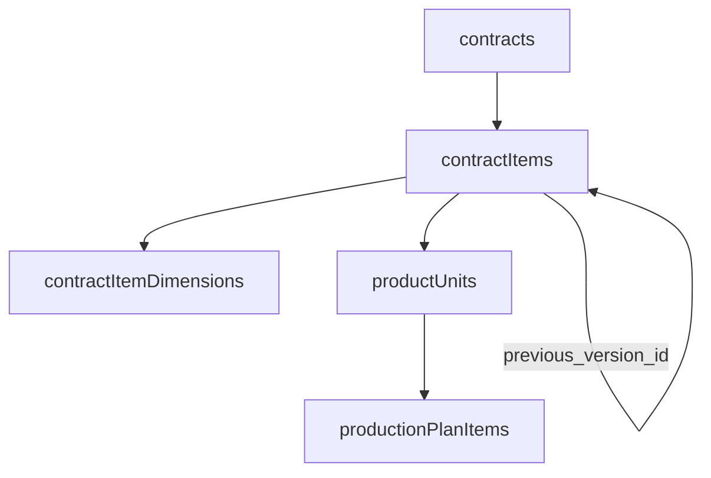

# Contract item history

How contract line items (`contract_items`) are created, amended, and cancelled while preserving a full audit trail. Nothing is hard-deleted.

Implementation rules for NestJS services live in [`app-logic-reminder.md`](./app-logic-reminder.md) §10.

---

## Principles

1. **Immutable lines** — once a `contract_item` row exists, do not mutate its business fields. Changes use cancel-and-replace.
2. **Soft cancellation** — `cancelled_at` marks a row as inactive; history remains queryable.
3. **Version chain** — replacement rows point to their predecessor via `previous_version_id` (new → old).
4. **Cascade down** — cancelling an item cancels its `product_units` and their `production_plan_items`. Cancelling the contract cancels all active items the same way.
5. **Audit on the line** — `created_by`, `cancelled_by`, and `cancellation_reason` live on `contract_items` only, not on cascaded children.

---

## Entity hierarchy



`contract_item_dimensions` is 1:1 with an item. It has no cancellation column — when dimensions change, the whole item is replaced and a new dimensions row is created on the replacement item.

---

## Operations

### 1. Append

**Trigger:** a new product line is added to an existing contract.

| Step | Action |
|------|--------|
| 1 | INSERT `contract_items` (`previous_version_id = null`, `created_by` = acting user) |
| 2 | INSERT `contract_item_dimensions` if custom dimensions apply |
| 3 | CREATE `product_units` (count = quantity, auto serial numbers) |
| 4 | Recalculate `contracts.total_amount` |

No prior row is cancelled.

---

### 2. Cancel item

**Trigger:** a line is removed from the contract without a replacement.

| Step | Action |
|------|--------|
| 1 | UPDATE item: `cancelled_at`, `cancelled_by`, `cancellation_reason` |
| 2 | CASCADE: `cancelled_at` on active `product_units` |
| 3 | CASCADE: `cancelled_at` on active `production_plan_items` for those units |
| 4 | Recalculate `contracts.total_amount` |

---

### 3. Replace item

**Trigger:** quantity, dimensions (which reprices the line), unit price, or product code changes.

| Step | Action |
|------|--------|
| 1 | INSERT replacement `contract_items` with new values, `previous_version_id = old id`, `created_by` |
| 2 | UPDATE old item: `cancelled_at`, `cancelled_by`, `cancellation_reason` |
| 3 | CASCADE old item's active units and plan items (same as cancel item) |
| 4 | INSERT new `contract_item_dimensions` on replacement when dimensions change |
| 5 | Apply quantity delta on replacement (see below) |
| 6 | Recalculate `contracts.total_amount` |

**Quantity delta on replacement:**

| Change | Units |
|--------|-------|
| Quantity ↑ | Create additional `product_units` under the **new** item |
| Quantity ↓ | Cancel excess **active** units on the **old** item; cancel their plan items |
| Unchanged | Create fresh units under the **new** item; old units stay on cancelled item for history |

Returns of materials or semi-finished parts from cancelled in-progress work are planned for a later implementation.

---

### 4. Cancel contract

**Trigger:** the whole order is cancelled.

| Step | Action |
|------|--------|
| 1 | UPDATE `contracts.cancelled_at` |
| 2 | App-sync `cancelled_at` on all active `contract_items` (`cancelled_by` / `cancellation_reason` null) |
| 3 | CASCADE each item → units → plan items |
| 4 | Recalculate `contracts.total_amount` (will be `0`) |

---

## Version chain

Replacements form a linked list via `previous_version_id`:

```
Item A (cancelled)  ←  Item B (cancelled)  ←  Item C (active)
     ↑                        ↑                      |
     └──── previous_version_id ┴──── previous_version_id
```

- **Forward:** follow `previous_version_id` from the current row to older versions.
- **Backward:** `SELECT * FROM contract_items WHERE previous_version_id = :id` to find what replaced a given row.

---

## Query patterns

| Need | Filter |
|------|--------|
| Active lines on a contract | `contract_id = ? AND cancelled_at IS NULL` |
| Full line history | `contract_id = ?` (include cancelled) |
| Replacement chain for one line | Walk `previous_version_id` forward, or query `WHERE previous_version_id = ?` for successors |
| Units ready for production | `contract_item_id = ? AND cancelled_at IS NULL` |
| Active plan work | `production_plan_items` where `cancelled_at IS NULL AND completed_at IS NULL` |

---

## Mutation trigger reference

| Business change | Operation |
|-----------------|-----------|
| New line on contract | Append |
| Line removed | Cancel item |
| Quantity changed | Replace item |
| Dimensions updated (reprices) | Replace item |
| Product code swapped | Replace item |
| Whole contract cancelled | Cancel contract → cascade |

---

## Schema columns (contract_items)

| Column | Role |
|--------|------|
| `created_by` | Who added this line (may differ from contract creator) |
| `cancelled_at` | When this line became inactive |
| `cancelled_by` | Who triggered cancellation; null on contract-level cascade |
| `cancellation_reason` | Why the line was cancelled or replaced |
| `previous_version_id` | On replacement rows only — FK to the cancelled predecessor |

Related cancellation columns (cascade only, no audit fields):

- `product_units.cancelled_at`
- `production_plan_items.cancelled_at` (mutually exclusive with `completed_at`)
